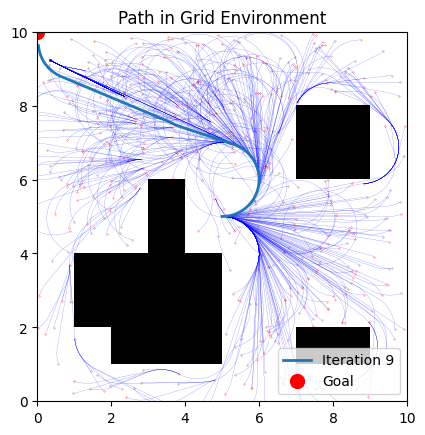
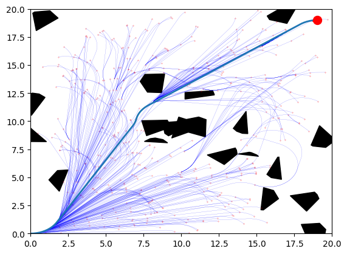
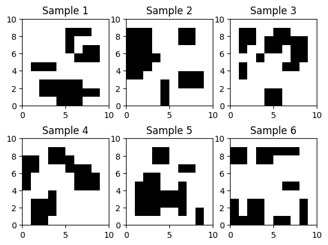
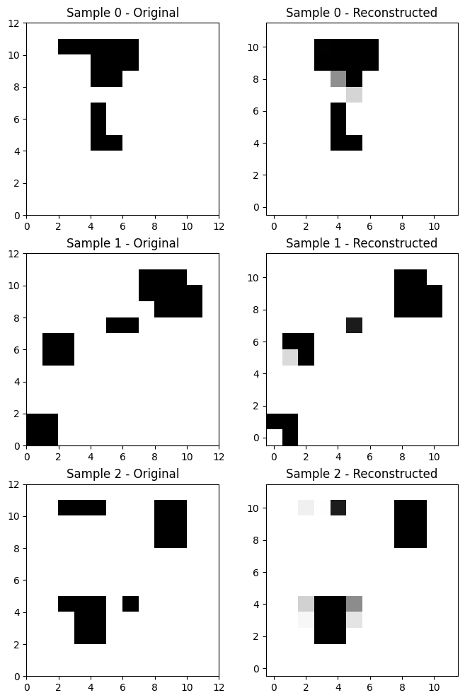
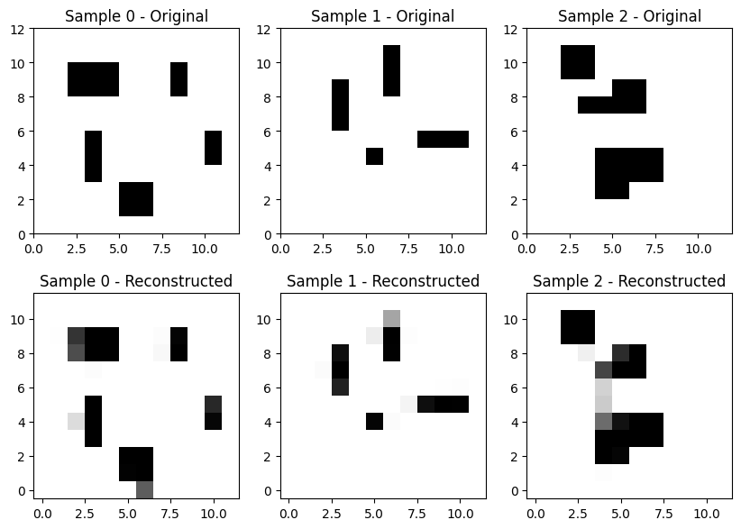
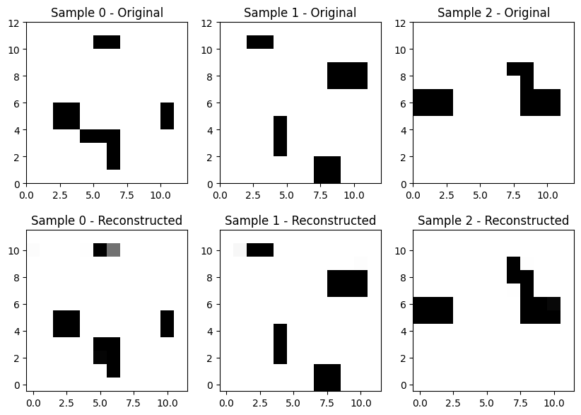
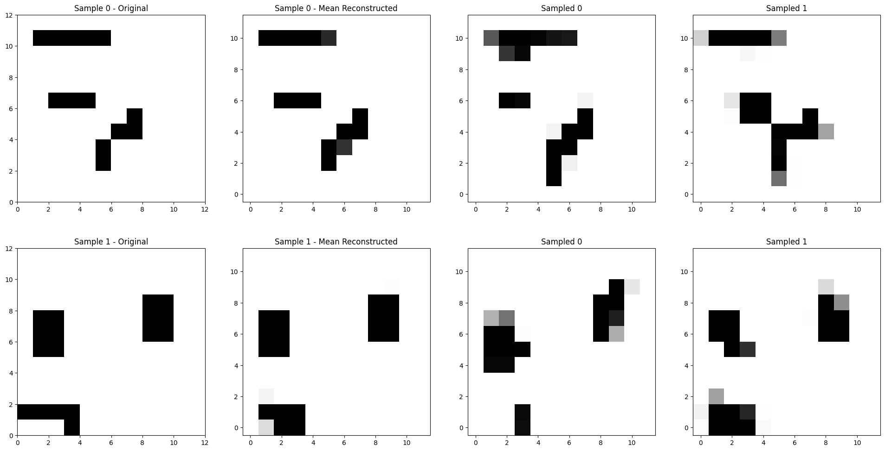

# dynamic_mpnet
Dynamic Motion Planning Net (Dynamic MPNet) Implemented for a Dubins vehicle

## RRT* Implementation for a Dubins Vehicle

| | |
| --- | --- |
|  |  |

## Training Grid Environment Generation

## Map Representation in Latent Space

The paper [2] compresses the local OGM space into a latent representation using a CNN as an AutoEncoder.

My first iteration was somewhat successful, but I ultimately decided I would instead implement it as a Variational Autoencoder.

A more refined version trained with larger obstacles and 4 times as much data

### Variational Autoencoder
Switching to a VAE approach improved performance.

Can sample from the VAE latent space, which creates similar maps:

## References:

[1] S. Karaman and E. Frazzoli, “Sampling-based algorithms for optimal motion planning,” The International Journal of Robotics Research, vol. 30, no. 7, pp. 846–894, Jun. 2011, doi: 10.1177/0278364911406761.

[2] J. J. Johnson, L. Li, F. Liu, A. H. Qureshi, and M. C. Yip, “Dynamically Constrained Motion Planning Networks for Non-Holonomic Robots,” 2020, arXiv. doi: 10.48550/ARXIV.2008.05112.

[3] https://github.com/FelicienC/RRT-Dubins for the files dubins.py and environment.py

[4] D. P. Kingma and M. Welling, “Auto-Encoding Variational Bayes,” 2013, arXiv. doi: 10.48550/ARXIV.1312.6114.

[5] D. Bank, N. Koenigstein, and R. Giryes, “Autoencoders,” 2020, arXiv. doi: 10.48550/ARXIV.2003.05991.

