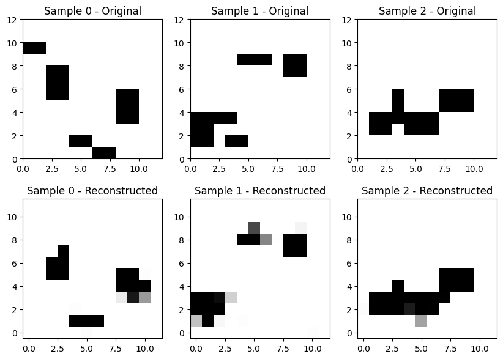
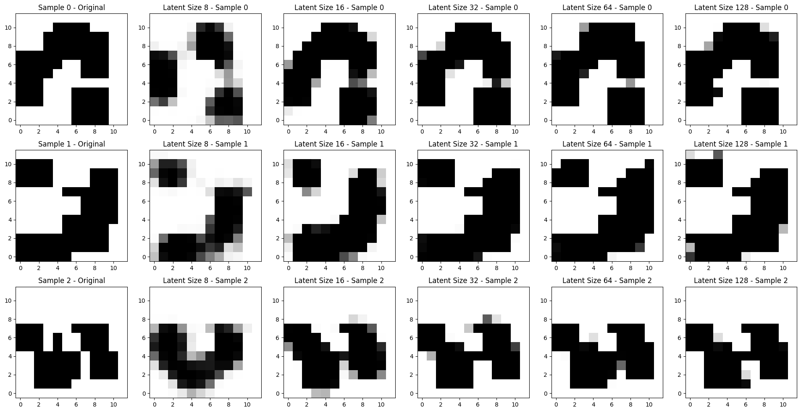

# dynamic_mpnet
Dynamic Motion Planning Net (Dynamic MPNet) Implemented for a Dubins vehicle

## RRT* Implementation for a Dubins Vehicle

| | |
| --- | --- |
|  |  |

## Training Grid Environment Generation


## Map Representation in Latent Space

The paper [2] compresses the local OGM space into a latent representation using a CNN as an AutoEncoder.

My first iteration was somewhat successful, but I ultimately decided I would instead implement it as a Variational Autoencoder.



A more refined version trained with larger obstacles and 4 times as much data


### Variational Autoencoder
Switching to a VAE approach improved performance.


Can sample from the VAE latent space, which creates similar maps:


### VAE Performance by Latent Space
These test were conducted with small osbtacles sizes like the ones above:


### Evaluated on Large Obstacles

This network was trained with larger, but less, obstacles (4). 
In theory, latent representation would be lower dimensional, even with a similar number of cells occupied


I also wanted to evalute the model on out of distribution data, so I ran it against environmnents with 8 (large) obstacles to see performance.


## Reference Trajectory Generation
Following the recommendations of the paper, I created a docker container for the project so RRT trajectory generation could be parallelized. (Python doesn't really support parallelism for CPU intensive work due to the GIL)

In order to generate data, run the following (assuming docker installed):
```
docker build -t dynamic_mpnet .
chmod +x ./run_parallel.sh
./run_parallel.sh -n X -- --num_maps 10 --num_samples_per 20
```
Where X is the number of concurrent containers to run. Once this completes, run:
```
python3 code/summarize_data.py
```
to generate a summary output of the generated data, including the number of distinct maps and trajectories generated.

## Dynamic MPNet

## Model Validation
Following the example set in class, to debug my model I overfit it to a handful of datapoints to ensure it could memorize and reconstruct those successfully. I was able to verify the model, and teh results looked like this:


## References:

[1] S. Karaman and E. Frazzoli, “Sampling-based algorithms for optimal motion planning,” The International Journal of Robotics Research, vol. 30, no. 7, pp. 846–894, Jun. 2011, doi: 10.1177/0278364911406761.

[2] J. J. Johnson, L. Li, F. Liu, A. H. Qureshi, and M. C. Yip, “Dynamically Constrained Motion Planning Networks for Non-Holonomic Robots,” 2020, arXiv. doi: 10.48550/ARXIV.2008.05112.

[3] https://github.com/FelicienC/RRT-Dubins for the files dubins.py and environment.py

[4] D. P. Kingma and M. Welling, “Auto-Encoding Variational Bayes,” 2013, arXiv. doi: 10.48550/ARXIV.1312.6114.

[5] D. Bank, N. Koenigstein, and R. Giryes, “Autoencoders,” 2020, arXiv. doi: 10.48550/ARXIV.2003.05991.

